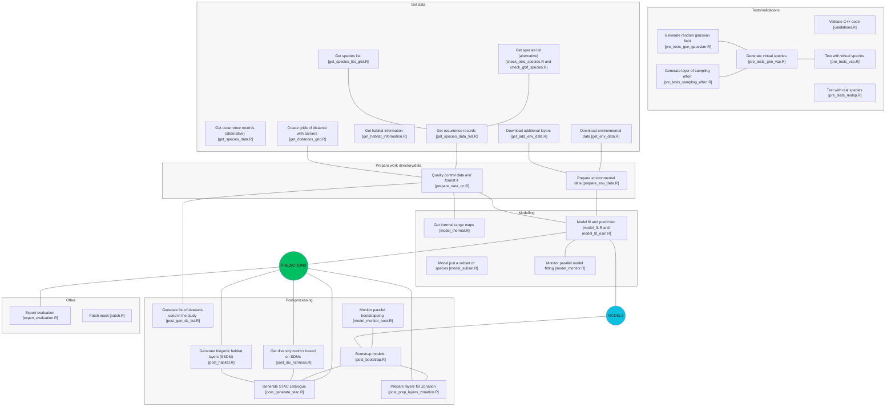

#  MPA Europe - Species distribution models for marine species occurring in European waters

## About the project

This work is part of the [MPA Europe project](https://mpa-europe.eu/). OBIS is leading the WP3, which aims to generate distribution maps for marine species and habitats in Europe. This repository contains the code for generating the SDMs (species distribution models) and stacked SDMs (habitat maps).

The core functions behind our modelling framework are in the repository [iobis/mpaeu_msdm](https://github.com/iobis/mpaeu_msdm)(from 'methods' SDM), which contains the package `obissdm`. A more detailed documentation of our framework can be found [here](https://iobis.github.io/mpaeu_docs).

Maps are available through a Shiny application, accessible from [shiny.obis.org/distmaps](https://shiny.obis.org/distmaps). Codes used to produce the platform are also open, and are available through [this repository](https://github.com/iobis/mpaeu_map_platform). All results are available on an AWS S3 bucket, as described [here](https://iobis.github.io/mpaeu_docs/data_access.html).

> [!IMPORTANT]
> Species distribution models (SDMs) are valuable tools, but it's important to understand how to interpret their results correctly. Before using the maps generated in this project read the documentation available [here](https://iobis.github.io/mpaeu_docs/understanding.html). Results reflect the data available at the time of the project and the modelling decisions made. After this project is concluded, OBIS will continue to develop and improve its SDM framework, so newer versions of the maps may be available in the future.

## Replicating the project

This GitHub repository contains only the codes/functions. You can clone it to your computer, and download the remaining data from AWS and from the sources (e.g. Bio-ORACLE, OBIS and GBIF). The easiest way is to run sequentially the 5 main codes (named `p*_`) which organizes the steps.

- **p1_prepare_wd.R**: will install the requirements (R and Python packages) and check the folder structure  
- **p2_download_data.R**: download all necessary data  
- **p3_prepare_data.R**: used to prepare the data for modelling (including standardization and QC)  
- **p4_model_distribution.R**: fit the models and make predictions. Code is run in parallel
- **p5_stack_habitats.R**: stack the SDMs from different groups to produce habitat maps

> [!NOTE]
> If you just want to reproduce the modelling, not using the most recent data, you can skip step 3 and use the prepared data available on the AWS S3 bucket, which is downloaded through step 2 (`p2_download_data.R`).

## Directory structure

Cloning this repository and running the main codes will render a directory with the following structure:


    ├── README.md              : Description of this repository
    ├── LICENSE                : Repository license
    ├── mpaeu_sdm.Rproj        : RStudio project file
    ├── .gitignore             : Files and directories to be ignored by git
    ├── requirements.R         : Project requirements
    ├── check.R                : Check project structure
    ├── sdm_conf.yml           : Configuration file for the models
    ├── datasets_citation.json : Datasets from OBIS/GBIF used in the project
    │
    ├── data
    │   ├── raw                : Source data obtained from repositories (e.g. OBIS, GBIF)
    │   ├── distances          : Distances with barriers, used for QC steps
    │   ├── log                : Log objects
    │   ├── species            : Processed species data
    │   ├── shapefiles         : Shapefiles
    │   └── environmental      : Environmental data
    │       ├── current        : Data for current period
    │       ├── terrain        : Data for terrain variables (e.g. bathymetry)
    │       └── future         : Data for future period (a folder for each scenario)
    │
    ├── codes                  : All codes
    │
    ├── functions              : Functions used in the project
    │
    ├── results                : Results for the SDMs - see details below
    │
    └── analysis               : Short analysis done during the project

## Main codes

As already noted, most of the components of the SDM framework are provided through the [`obissdm` package](https://github.com/iobis/mpaeu_msdm). The codes and functions of this repository only _operationalize_ the modelling.

Codes are all commented, with additional information provided on headers. In general, codes follow this naming convention:

- check\_\*: check species occurring in an area, etc.
- get\_\*: obtain data for something.
- prepare\_\*: prepare the data to be used.
- model\_\*: modeling the species’ distribution.
- pre_tests\_\*: tests with virtual species or other tests.

The code named `model_subset.R` enable you to pass a subset of species for modelling (instead of the full list). If you want to run models for just a subset of species, don't run the code `p4_model_distributions.R` and run this one instead.

Below you can see a description of the codes used in this project:



## Running models for the full list of species

Ensure that the working directory is correctly built. From **the root of the working directory** run the 3 first steps:

``` bash
Rscript codes/p1_prepare_wd.R
Rscript codes/p2_download_data.R
Rscript codes/p3_prepare_data.R
```
Then, run the 4th step to obtain the models:

``` bash
Rscript codes/p4_model_distributions.R
```

Or, to run for just a subset, change the `model_subset.R` file and then run it:

``` bash
Rscript codes/model_subset.R
```
Finally, run the 5th step to stack the habitat maps:

``` bash
Rscript codes/p5_stack_habitats.R
```

## Results structure

The results are organized as:

`taxonid={aphiaID}/model={acronym of model run}/<folder> OR <file>`

With folders being 'figures', 'metrics', 'models' or 'predictions'

All files will contain `taxonid={aphiaID}_model={acronym of model run}` as part of their name.

Two files are saved on the root: 'taxonid={aphiaID}_model={acronym of model run}_what=fitocc.parquet', which contain the points used for model fitting, and 'taxonid={aphiaID}_model={acronym of model run}_what=log.json', a log file containing rich details about model fitting. A third file may be added later, 'taxonid={aphiaID}_model={acronym of model run}_what=experteval.json', which contains the expert evaluation results.

## Additional information

Some steps are controlled using [`storr`](https://richfitz.github.io/storr/). This will create `*_storr` folders, which you can later delete.

## Data sources and citation

Modelling was done using data from OBIS (Ocean Biodiversity Information System) and GBIF (Global Biodiversity Information Facility). **We acknowledge that this work was only possible due to the contribution of data providers and the work of OBIS and GBIF nodes who ensured that data flowed to the central repositories.** You can find the full list of datasets used in this work [here](https://iobis.github.io/mpaeu_docs/citations.html). When using range maps for a specific species, you can retrieve the datasets that contributed data for that species on our [Shiny application](https://shiny.obis.org/distmaps/). **Those should be cited together with the product.**

Cite this product as:

```
Ocean Biodiversity information System (OBIS). (2024). Species distribution dashboard for MPA Europe. (version 0.1.0). https://shiny.obis.org/distmaps. Zenodo. https://doi.org/10.5281/zenodo.14524781

GBIF.org (26 July 2024) GBIF Occurrence Data https://doi.org/10.15468/dl.ubwn8z

OBIS (25 June 2024) OBIS Occurrence Snapshot. Ocean Biodiversity Information System. Intergovernmental Oceanographic Commission of UNESCO. https://obis.org.

World Register of Marine Species. Available from https://www.marinespecies.org at VLIZ. Accessed 2024-05-01. doi:10.14284/170.
```

## Important

This was a 3 years long project, which was concluded in 2025. Consider that:
- New data is being added to OBIS and GBIF continuously, so results may differ if you replicate the project at a later date. The predictions reflect the data available at the time of the project.
- SDM is an area of active research, and new methods are being developed and improved continuously. The methods used in this project may be outdated in the future.
- New data access pathways were created to OBIS data after completion of the data processing phase of this project (see https://github.com/iobis/obis-open-data and https://github.com/iobis/speciesgrids). Thus, some of the data download codes may not work as expected in the future. We added notes in the code, but you may need to adapt them to the new data access methods.

## Updates

You can check updates on the project [here](NEWS.md), including changes in the code that may be accounted for when replicating the results.

## Support

Grant Agreement 101059988 – MPA Europe | MPA Europe project has been approved under HORIZON-CL6-2021-BIODIV-01-12 — Improved science based maritime spatial planning and identification of marine protected areas.

Co-funded by the European Union. Views and opinions expressed are however those of the authors only and do not necessarily reflect those of the European Union or UK Research and Innovation. Neither the European Union nor the granting authority can be held responsible for them.