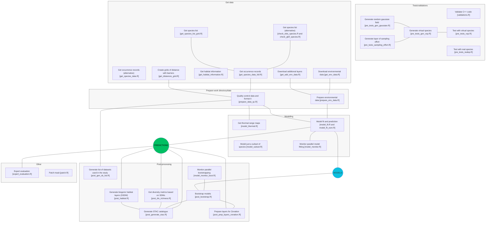

#  MPA Europe - Pipeline for producing species distribution models for marine species in European waters

## About the project

This work is part of the [MPA Europe project](https://mpa-europe.eu/). OBIS led WP3, which aimed to generate distribution maps for marine species and habitats in Europe. This repository contains the code for generating the SDMs (species distribution models) and stacked SDMs (habitat maps).

The core functions behind our modelling framework are in the repository [iobis/mpaeu_msdm](https://github.com/iobis/mpaeu_msdm) (from 'methods' SDM), which contains the package `obissdm`. More detailed documentation of our framework can be found [here](https://iobis.github.io/mpaeu_docs).

Details on how to access the maps are available on the repository [iobis/mpaeu_maps](https://github.com/iobis/mpaeu_maps). You can explore the models through the [map platform](https://iobis.github.io/mpaeu_map_plat_static). All results are available on an AWS S3 bucket, as described [here](https://iobis.github.io/mpaeu_docs/datause.html).

> [!IMPORTANT]
> Species distribution models (SDMs) are valuable tools, but it's important to understand how to interpret their results correctly. Before using the maps generated in this project read the documentation available [here](https://iobis.github.io/mpaeu_docs/understanding.html). Results reflect the data available at the time of the project and the modelling decisions made. Now that this project has concluded, OBIS will continue to develop and improve its SDM framework, so newer versions of the maps may be available in the future.

## Associated repositories

- [**iobis/mpaeu_maps**](https://github.com/iobis/mpaeu_maps): details on data access and how to cite the product  
- [**iobis/mpaeu_msdm**](https://github.com/iobis/mpaeu_msdm): R package for internal use containing the core functions behind our modelling framework  
- [**iobis/mpaeu_map_platform**](https://github.com/iobis/mpaeu_map_platform): Shiny app developed to host the maps, now deprecated in favor of the new platform  
- [**iobis/mpaeu_map_plat_static**](https://github.com/iobis/mpaeu_map_plat_static): new platform developed with Svelte to host the maps  
- [**iobis/mpaeu_docs**](https://github.com/iobis/mpaeu_docs): documentation of the modelling  
- [**iobis/mpaeu_atlas**](https://github.com/iobis/mpaeu_atlas): atlas application developed with Svelte to host the main results of the project  

## Replicating the project

This GitHub repository contains only the code/functions. You can clone it to your computer, and download the remaining data from AWS and from the sources (e.g. Bio-ORACLE, OBIS and GBIF). The easiest way is to sequentially run the 5 main scripts (named `p*_`), which organize the steps.

- **p1_prepare_wd.R**: installs the requirements (R and Python packages) and checks the folder structure  
- **p2_download_data.R**: downloads all necessary data  
- **p3_prepare_data.R**: prepares the data for modelling (including standardization and QC)  
- **p4_model_distributions.R**: fits the models and makes predictions. The code runs in parallel
- **p5_stack_habitats.R**: stacks the SDMs from different groups to produce habitat maps

> [!NOTE]
> If you just want to reproduce the modelling without using the most recent data, you can skip step 3 and use the prepared data available on the AWS S3 bucket, which is downloaded through step 2 (`p2_download_data.R`).

## Directory structure

Cloning this repository and running the main scripts will produce a directory with the following structure:


    ├── README.md              : Description of this repository
    ├── LICENSE                : Repository license
    ├── mpaeu_sdm.Rproj        : RStudio project file
    ├── .gitignore             : Files and directories to be ignored by git
    ├── requirements.R         : Project requirements
    ├── check.R                : Check project structure
    ├── sdm_conf.yml           : Configuration file for the models
    ├── datasets_citation.json : Datasets from OBIS/GBIF used in the project
    ├── aws_files_list.zip     : A list of all files available on the AWS S3 bucket
    │
    ├── data
    │   ├── raw                : Source data obtained from repositories (e.g. OBIS, GBIF)
    │   ├── distances          : Distances with barriers, used for QC steps
    │   ├── log                : Log objects
    │   ├── species            : Processed species data
    │   ├── shapefiles         : Shapefiles
    │   └── environmental      : Environmental data
    │       ├── current        : Data for current period
    │       ├── terrain        : Data for terrain variables (e.g. bathymetry)
    │       └── future         : Data for future period (a folder for each scenario)
    │
    ├── codes                  : All scripts
    │
    ├── functions              : Functions used in the project
    │
    ├── results                : Results for the SDMs - see details below
    │
    └── analysis               : Short analyses done during the project

## Main scripts

As already noted, most of the components of the SDM framework are provided through the [`obissdm` package](https://github.com/iobis/mpaeu_msdm). The scripts and functions of this repository only _operationalize_ the modelling.

Scripts are all commented, with additional information provided in the headers. In general, scripts follow this naming convention:

- check\_\*: check species occurring in an area, etc.
- get\_\*: obtain data for something.
- prepare\_\*: prepare the data to be used.
- model\_\*: model the species' distribution.
- pre_tests\_\*: run tests with virtual species or other tests.

The script named `model_subset.R` enables you to pass a subset of species for modelling (instead of the full list). If you want to run models for just a subset of species, don't run the script `p4_model_distributions.R`; run this one instead.

Below you can see a description of the scripts used in this project:


``` mermaid
flowchart
	subgraph s1["Tests/validations"]
		n16["Validate C++ code [validations.R]"]
		n5@{ label: "Rectangle" }
		n4@{ label: "Rectangle" }
		n3@{ label: "Rectangle" }
		n2["Test with real species [pre_tests_realsp.R]"]
		n1["Test with virtual species [pre_tests_vsp.R]"]
        n1
	end
	n3["Generate virtual species [pre_tests_gen_vsp.R]"] --- n1
	n4["Generate random gaussian field [pre_tests_gen_gaussian.R]"] --- n3
	n5["Generate layer of sampling effort [pre_tests_sampling_effort.R]"] --- n3
	style s1 fill:#F7F7F7,stroke:#545454
	subgraph s2["Prepare work directory/data"]
		n7["Prepare environmental data [prepare_env_data.R]"]
		n6["Quality control data and format it [prepare_data_qc.R]"]
	end
    style s2 fill:#F7F7F7,stroke:#545454
	subgraph s3["Get data"]
		n15@{ label: "Rectangle" }
		n14["Get species list"]
		n13["Get occurrence records (alternative) [get_species_data.R]"]
		n12["Get occurrence records [get_species_data_full.R]"]
		n11["Get habitat information [get_habitat_information.R]"]
		n10["Create grids of distance with barriers [get_distances_grid.R]"]
		n9["Download additional layers [get_add_env_data.R]"]
		n8["Download environmental data [get_env_data.R]"]
	end
    style s3 fill:#F7F7F7,stroke:#545454
	n9 --- n7
	n8 --- n7
	n10 --- n6
	n12 --- n6
	n14["Get species list [get_species_list_grid.R]"] --- n12
	n15["Get species list (alternative) [check_obis_species.R and check_gbif_species.R]"] --- n12
	subgraph s4["Modelling"]
		n31["Model just a subset of species [model_subset.R]"]
		n19["Get thermal range maps [model_thermal.R]"]
		n18["Monitor parallel model fitting [model_monitor.R]"]
		n17["Model fit [model_fit.R]"]
	end
    style s4 fill:#F7F7F7,stroke:#545454
	n17 --- n18
	n6 --- n17
	n6 --- n19
	n7 --- n17
	subgraph s5["Post-processing"]
		n26["Generate STAC catalogue [post_generate_stac.R]"]
		n25["Prepare layers for Zonation [post_prep_layers_zonation.R]"]
		n24["Get diversity metrics based on SDMs [post_div_richness.R]"]
		n23["Generate biogenic habitat layers (SSDM) [post_habitat.R]"]
		n22["Generate list of datasets used in the study [post_gen_ds_list.R]"]
		n21["Monitor parallel bootstrapping [model_monitor_boot.R]"]
		n20
	end
    style s5 fill:#F7F7F7,stroke:#545454
	n17["Model fit and prediction [model_fit.R]"]
	n20["Bootstrap models [post_bootstrap.R]"]
	n20
	n21
	n6 --- n22
	n17
	n23
	n17
	n24
	n17
	n25
	n23 --- n26
	n24 --- n26
	n20 --- n26
	n27@{ shape: "circle", label: "PREDICTIONS" }
	style n27 color:#000000,fill:#00BF63
	n17
	n27
	n17 --- n27
	n28@{ shape: "circle", label: "MODELS" }
	style n28 fill:#0CC0DF
	n17["Model fit and prediction [model_fit.R and model_fit_esm.R]"] --- n28
	n27 --- n23
	n27 --- n24
	n27 --- n26
	n28 --- n20
	n27 ----- n25
	n20 --- n25
	n21 --- n20
	subgraph s6["Other"]
		n30@{ label: "Rectangle" }
		n29["Patch mask [patch.R]"]
	end
	style s6 fill:#F7F7F7,stroke:#545454
	n27 --- n30["Expert evaluation [expert_evaluation.R]"]
	n28
```

## Running models for the full list of species

Ensure that the working directory is correctly built. From **the root of the working directory** run the first 3 steps:

``` bash
Rscript codes/p1_prepare_wd.R
Rscript codes/p2_download_data.R
Rscript codes/p3_prepare_data.R
```
Then, run the 4th step to obtain the models:

``` bash
Rscript codes/p4_model_distributions.R
```

Or, to run for just a subset, change the `model_subset.R` file and then run it:

``` bash
Rscript codes/model_subset.R
```
Finally, run the 5th step to stack the habitat maps:

``` bash
Rscript codes/p5_stack_habitats.R
```

## Results structure

The results are organized as:

`taxonid={aphiaID}/model={acronym of model run}/<folder> OR <file>`

Folders can be 'figures', 'metrics', 'models' or 'predictions'.

All files will contain `taxonid={aphiaID}_model={acronym of model run}` as part of their name.

Two files are saved in the root: 'taxonid={aphiaID}_model={acronym of model run}_what=fitocc.parquet', which contains the points used for model fitting, and 'taxonid={aphiaID}_model={acronym of model run}_what=log.json', a log file containing rich details about model fitting. A third file may be added later, 'taxonid={aphiaID}_model={acronym of model run}_what=experteval.json', which contains the expert evaluation results.

## Additional information

Some steps are controlled using [`storr`](https://richfitz.github.io/storr/). This will create `*_storr` folders, which you can later delete.

## Data sources and citation

Modelling was done using data from OBIS (Ocean Biodiversity Information System) and GBIF (Global Biodiversity Information Facility). **We acknowledge that this work was only possible due to the contribution of data providers and the work of OBIS and GBIF nodes who ensured that data flowed to the central repositories.** You can find the full list of datasets used in this work [here](https://iobis.github.io/mpaeu_docs/citations.html). When using range maps for a specific species, you can retrieve the datasets that contributed data for that species on our [Shiny application](https://shiny.obis.org/distmaps/). **Those should be cited together with the product.**

Cite this product as:

```
Ocean Biodiversity information System (OBIS). (2024). Species distribution dashboard for MPA Europe. (version 0.1.0). https://shiny.obis.org/distmaps. Zenodo. https://doi.org/10.5281/zenodo.14524781

GBIF.org (26 July 2024) GBIF Occurrence Data https://doi.org/10.15468/dl.ubwn8z

OBIS (25 June 2024) OBIS Occurrence Snapshot. Ocean Biodiversity Information System. Intergovernmental Oceanographic Commission of UNESCO. https://obis.org.

World Register of Marine Species. Available from https://www.marinespecies.org at VLIZ. Accessed 2024-05-01. doi:10.14284/170.
```

## Important

This was a three-year project, which concluded in 2025. Consider that:
- New data is being added to OBIS and GBIF continuously, so results may differ if you replicate the project at a later date. The predictions reflect the data available at the time of the project.
- SDM is an area of active research, and new methods are being developed and improved continuously. The methods used in this project may be outdated in the future.
- New pathways to access OBIS data were created after completion of the data processing phase of this project (see https://github.com/iobis/obis-open-data and https://github.com/iobis/speciesgrids). Thus, some of the data download scripts may not work as expected in the future. We added notes in the code, but you may need to adapt them to the new data access methods.

## Updates

You can check updates on the project [here](NEWS.md), including changes in the code that may be accounted for when replicating the results.

## Support

Grant Agreement 101059988 – MPA Europe | MPA Europe project has been approved under HORIZON-CL6-2021-BIODIV-01-12 — Improved science based maritime spatial planning and identification of marine protected areas.

Co-funded by the European Union. Views and opinions expressed are however those of the authors only and do not necessarily reflect those of the European Union or UK Research and Innovation. Neither the European Union nor the granting authority can be held responsible for them.